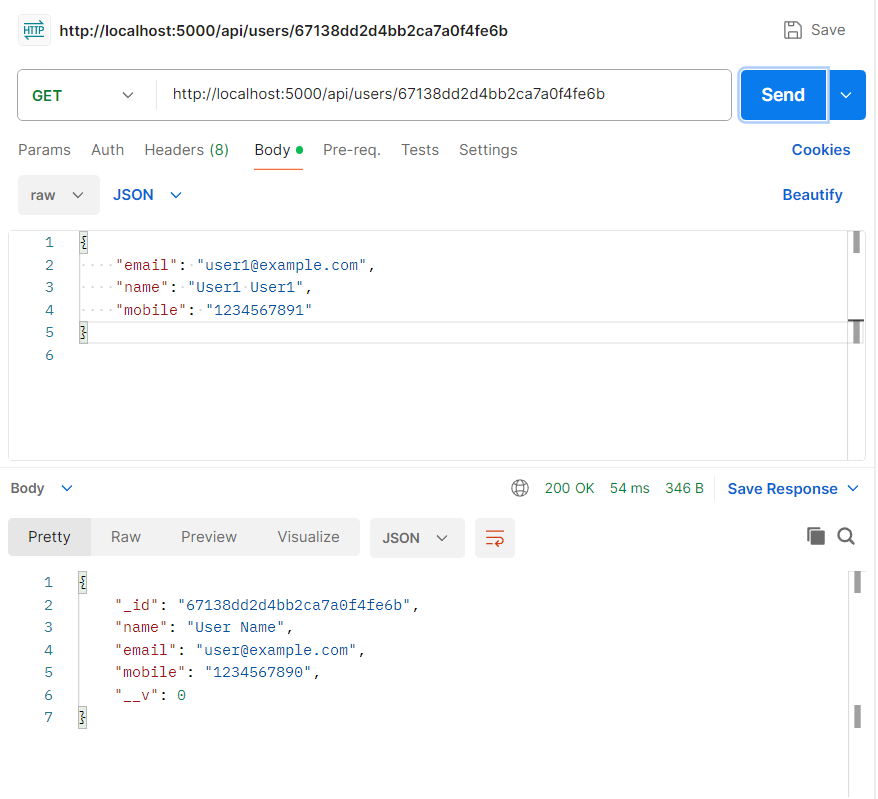
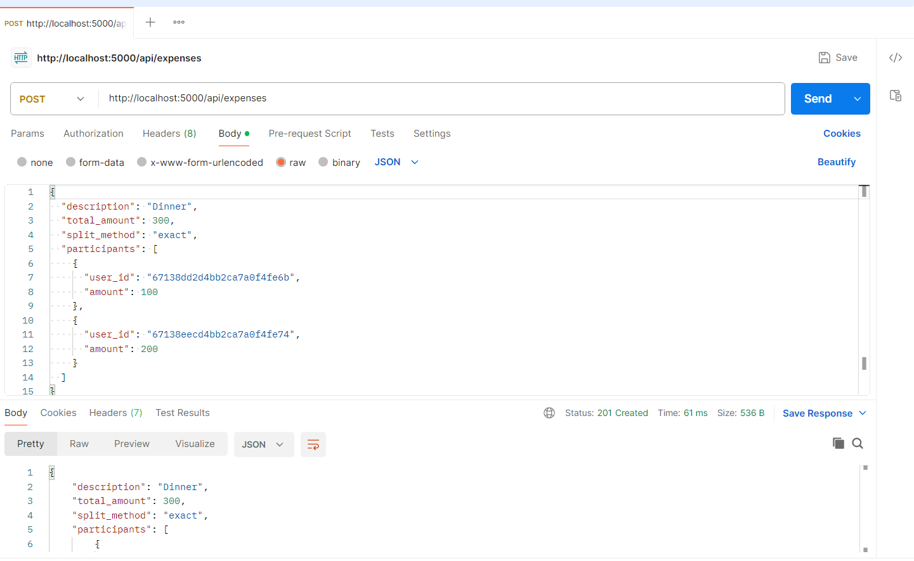
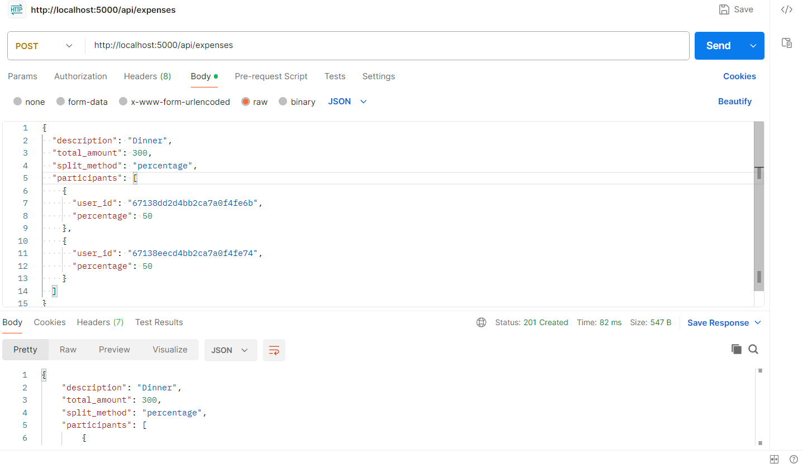
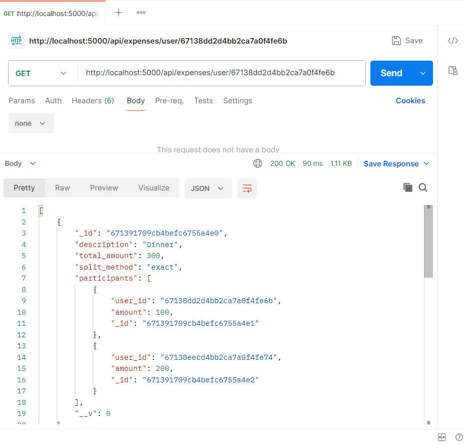
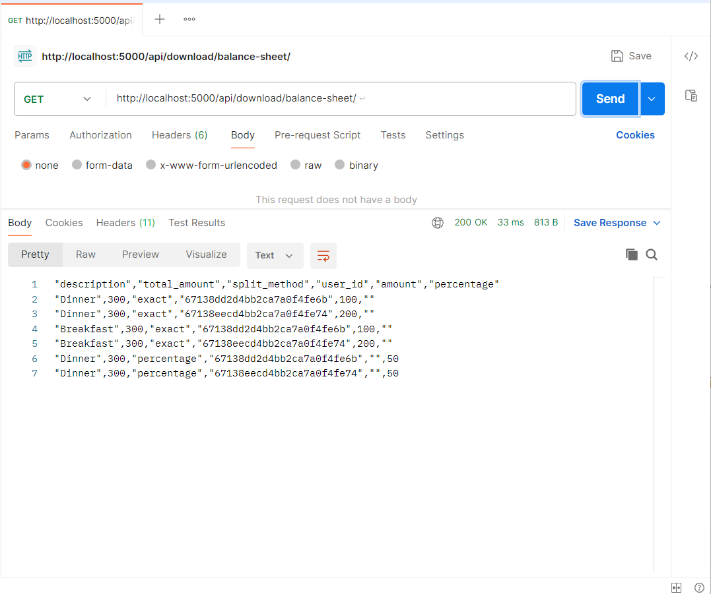
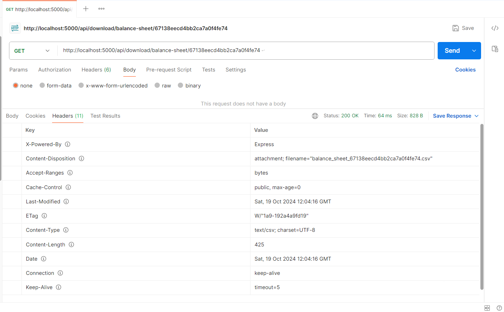

# EXPENSES TRACKER

The Expense Tracker is a web application that helps users manage and monitor their expenses, allowing them to add, view, and download expense data for better financial insights.

## Description

This project focuses on effective expense tracking and management, enabling users to input expenses and distribute costs through equal, exact, or percentage methods. It utilizes technologies such as Node.js, Express, and MongoDB.

## Table of Contents

1. [Installation](#installation)
2. [API Testing](#api-testing)
3. [Contact](#contact)

## Installation

Follow these steps to set up your development environment:

1. **Clone the repository:**

    ```bash
    git clone <repository-url>
    cd <project-folder>
    ```

2. **Install dependencies:**

    ```bash
    npm install
    ```

   This command will install all necessary packages from `package.json`, including:
   - `express` (for building the server)
   - `mongoose` (for MongoDB integration)
   - `dotenv` (for environment variable management)
   - `body-parser` (to parse incoming request bodies)
   - `nodemon` (for auto-restarting the server during development)

3. **Create a `.env` file in the root of your project:**

    ```bash
    touch .env
    ```

   Add the following content to your `.env` file:

    ```plaintext
    PORT=5000
    MONGO_URI=<Your MongoDB Connection String>
    ```

4. **Start the server:**

    ```bash
    npm start
    ```

   This will start your backend at `http://localhost:5000`. 🎉

## API Testing

Check out the following Postman screenshots to see the API endpoints in action!

<div style="margin-bottom: 20px;">
    
    <p>Creating user</p>
</div>

<div style="margin-bottom: 20px;">
    
    <p>Creating expense using exact</p>
</div>

<div style="margin-bottom: 20px;">
    
    <p>Creating expense using percentage</p>
</div>

<div style="margin-bottom: 20px;">
    
    <p>Retrieving expenses for a particular user</p>
</div>

<div style="margin-bottom: 20px;">
    
    <p>Balance Sheet Download</p>
</div>

<div style="margin-bottom: 20px;">
    
    <p>Balance Sheet Headers</p>
</div>


## Contact

Nutan Singh - [nutansingh2394@gmail.com](mailto:nutansingh2394@gmail.com)  
Project Link: [GitHub Repository Link](https://github.com/nutan1202/Expenses-app)
